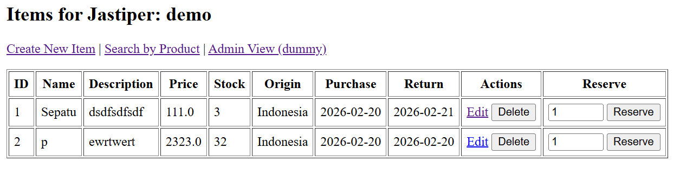

# Inventory

Spring Boot inventory service with Thymeleaf UI (frontend), REST/MVC backend, and MySQL/H2 database integration.

## Repository Links per Service
- Frontend: same repository (Thymeleaf templates in `src/main/resources/templates`)
- Backend: same repository (Spring Boot in `src/main/java`)
- Database: MySQL service (external runtime dependency, not a separate repository)

If your team uses split repositories, replace this section with actual URLs for each service.

## CI Quality Gates
Workflow files:
- CI: `.github/workflows/ci.yml`
- CodeQL: `.github/workflows/codeql.yml`
- CD (dummy, guarded by CI): `.github/workflows/cd.yml`

CI includes:
- Unit/integration tests (`./gradlew test`)
- JaCoCo report + threshold verification (`jacocoTestReport`, `jacocoTestCoverageVerification`)
- PMD static analysis (`pmdMain`)
- Checkstyle linter (`checkstyleMain`)

CodeQL includes:
- Security and quality analysis for Java/Kotlin on push, PR, and scheduled scan.

CD includes:
- Dummy deploy job that runs only when workflow `CI` has conclusion `success` on branch `main`.

## Frontend-Backend-DB Integration
Current integration path:
1. Frontend page `Items.html` sends create/update/delete/reserve/search requests.
2. Controller `ItemController` handles request/response and view rendering.
3. Service `ItemService` executes business logic.
4. Repository `ItemRepository` persists and queries JPA entities.
5. Database is MySQL in runtime (`application.properties`) and H2 for tests (`application-test.properties`).

Dummy end-to-end feature available:
- `POST /items/{id}/reserve` reserves stock (decrease with stock guard), then result is reflected back in UI.

